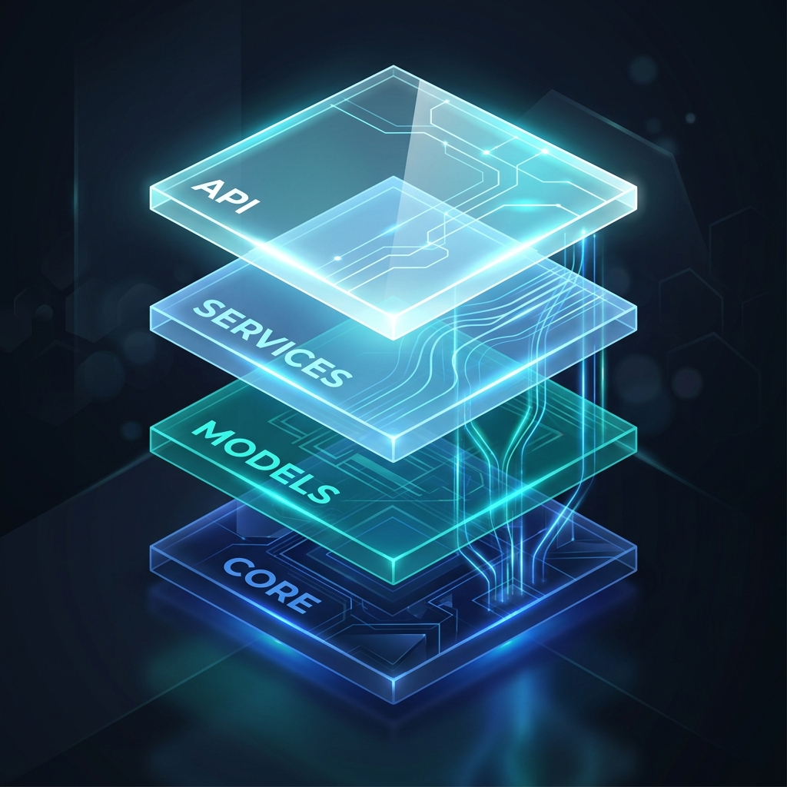
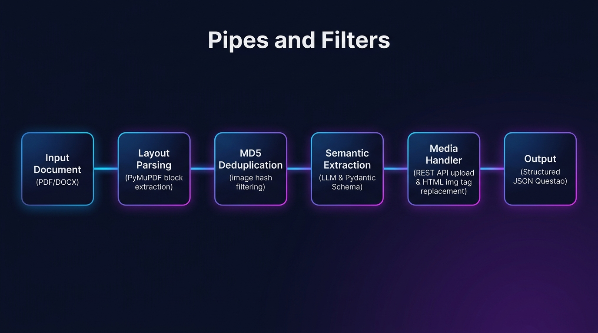
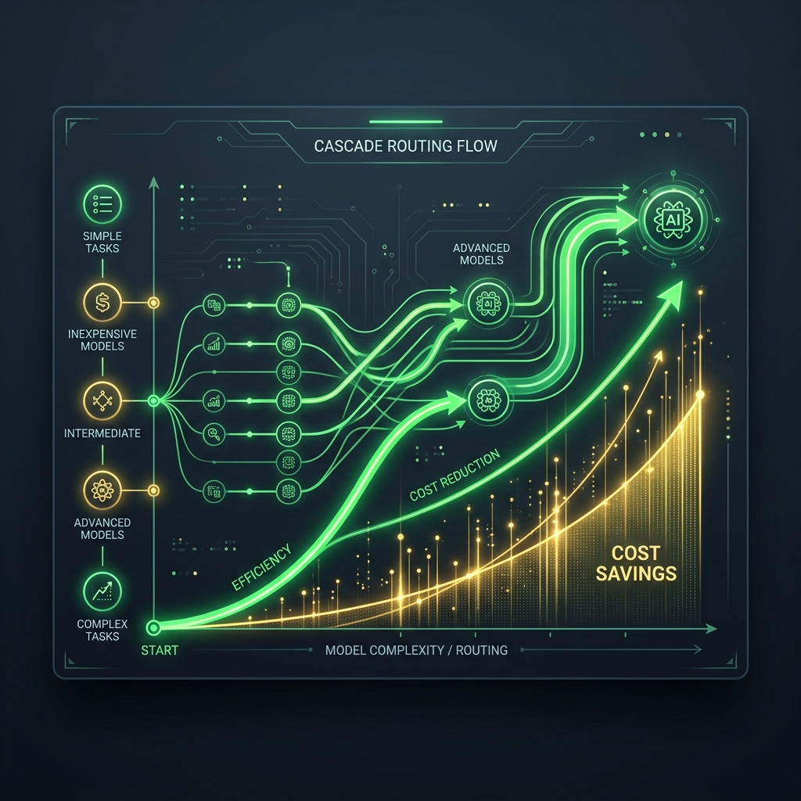

# Roteiro de Apresentação e Estrutura de Slides (15 Minutos)

Este documento contém a estruturação completa dos slides e a transcrição *ipsis litteris* de cada fala para a apresentação de 15 minutos sobre o projeto de avaliação de LLMs como assistentes de codificação e design arquitetural no estudo de caso da plataforma PLURI.

---

## Orientações Gerais para a Apresentação
* **Público-alvo:** Banca acadêmica, professores e pesquisadores da área de Engenharia de Software e Inteligência Artificial.
* **Ritmo:** Fale de forma pausada e articulada. A média de velocidade ideal é de aproximadamente 120 a 130 palavras por minuto.
* **Visual dos Slides:** Siga o padrão de design sugerido (tema escuro com tons de azul profundo e cinza ardósia, tipografia limpa como *Inter* ou *Outfit*, contraste com verde esmeralda para dados positivos e azul índigo para elementos neutros). Evite colocar blocos de texto nos slides; utilize listas rápidas, diagramas e tabelas, deixando as explicações aprofundadas para a sua fala.

---

## Slide 1: Capa e Identificação

### Proposta Visual e Design
* **Fundo:** Imagem temática abstrata em alta resolução com degradê suave de azul escuro profundo (`#0B0F19`) para preto.
* **Elemento Visual Principal:**
  
* **Tipografia:** Título principal em fonte sem serifa encorpada (*Outfit* ou *Inter*), cor branca, com destaque em degradê ciano/azul para a palavra "Co-autoria Arquitetural".
* **Layout:** Título centralizado no terço superior sobrepondo suavemente o elemento visual. No terço inferior, alinhados à esquerda, as informações do autor, orientador, programa de mestrado e instituição.
* **Conteúdo Textual do Slide:**
  * **Título Principal:** Avaliação de LLMs como Assistentes de Codificação e Design Arquitetural
  * **Subtítulo:** Um Estudo de Caso na Construção do Agente de Ingestão de Questões da Plataforma PLURI
  * **Autor:** Gabriel Camargos (gabriel.camargos@ufu.br)
  * **Instituição:** Universidade Federal de Uberlândia (UFU)
  * **Programa:** Mestrado em Ciência da Computação - IA
  * **Disciplina:** Engenharia de Software Inteligente

### Fala do Apresentador (Tempo Estimado: 1m 00s)
"Bom dia a todos. Eu sou o Gabriel Camargos e hoje tenho a satisfação de apresentar o trabalho 'Avaliação de LLMs como Assistentes de Codificação e Design Arquitetural: Um Estudo de Caso na Construção da Plataforma PLURI'. 

Este projeto foi desenvolvido. O foco principal da  investigação foi analisar o papel dos grandes modelos de linguagem, os LLMs, não apenas como meros autocompletadores de código em nível de método, mas como parceiros ativos na tomada de decisões de design, modelagem de contratos e refatoração de sistemas. Para tanto, utilizamos como cenário experimental a construção do agente de ingestão de dados da plataforma de educação PLURI."

---

## Slide 2: Contexto e Motivação: A Evolução da Inteligência Artificial na Engenharia de Software

### Proposta Visual e Design
* **Fundo:** Cinza escuro ardósia (`#0F172A`).
* **Layout:** Duas colunas contrastantes para marcar a evolução temporal. 
  * *Coluna Esquerda (Passado/Tradicional):* Foco em geração local de código e snippets (HumanEval). Ícone de teclado ou terminal.
  * *Coluna Direita (Presente/Futuro):* Foco em arquitetura holística (SDLC, Clean Architecture). Ícone de blocos modulares interconectados.
* **Conteúdo Textual do Slide:**
  * **A Era do Code Completion (Até 2023):** Foco em algoritmos isolados, funções matemáticas e testes sintáticos simples (ex: benchmark HumanEval).
  * **A Era da Co-Autoria Arquitetural (2024+):** IA atuando no ciclo de vida de desenvolvimento completo (SDLC), estruturando módulos, criando contratos de APIs, desacoplando dependências e projetando infraestrutura.
  * **Desafio Atual:** Superar a barreira de abstração — conseguir separar os detalhes de implementação de baixo nível da visão arquitetural global.

### Fala do Apresentador (Tempo Estimado: 1m 15s)
"Para entendermos a relevância deste trabalho, precisamos situá-lo na linha do tempo da evolução dos assistentes de codificação baseados em IA. Até recentemente, a maior parte da literatura científica e do uso comercial de LLMs focava no que chamamos de 'Code Completion', isto é, a geração automatizada de funções isoladas. Estudos clássicos, como o que introduziu o benchmark HumanEval, provaram que a IA é excelente para resolver quebra-cabeças de programação em nível de método.

No entanto, a engenharia de software do mundo real é muito mais complexa do que isso. Os nossos maiores gargalos de engenharia estão no ciclo de vida de desenvolvimento completo — o SDLC —, que abrange o design arquitetural, o desacoplamento de serviços e as integrações complexas. A nova fronteira, que investigamos neste artigo, é a Engenharia de Software Assistida por IA, ou AIE. O desafio técnico não é mais apenas gerar código sintaticamente correto, mas guiar o modelo para compreender restrições de negócio complexas, separar preocupações de arquitetura e projetar sistemas de produção robustos e manuteníveis."

---

## Slide 3: O Problema de Pesquisa e Perguntas Científicas (RQs)

### Proposta Visual e Design
* **Fundo:** Slate Grey (`#1E293B`).
* **Layout:** Grid de 2x2 com caixas de destaque contendo as quatro Questões de Pesquisa (RQs). Cada caixa possui uma borda sutil com gradiente azul.
* **Conteúdo Textual do Slide:**
  * **Problema Central:** Ingestão manual de bancos de dados legados educacionais gera alta carga cognitiva e risco de inconsistências arquiteturais e quebras de contrato de APIs.
  * **Perguntas de Pesquisa:**
    * **RQ1 (Eficácia):** Como diferentes modelos (Gemini Pro vs. Flash) se comportam na geração de módulos de parsing e integração sob requisitos reais?
    * **RQ2 (Design):** Em que medida o uso de LLMs facilita a definição de contratos de dados (Pydantic) e modularidade?
    * **RQ3 (Refatoração):** Qual o nível de intervenção humana (Edit Distance) necessário para tornar o código da IA pronto para produção?
    * **RQ4 (Prompting):** Como a transição de prompts *Zero-shot* para *Few-shot* com *Chain-of-Thought* impacta a robustez das extrações?

### Fala do Apresentador (Tempo Estimado: 1m 20s)
"Isso nos leva ao problema prático e científico deste trabalho. Organizações educacionais frequentemente enfrentam a dor de migrar bancos de questões legados, geralmente guardados em pastas confusas de PDFs e arquivos DOCX, para plataformas web estruturadas. Esse processo de mapear dados semiestruturados, extrair mídias físicas na ordem exata de leitura e validar os payloads contra APIs de produção impõe uma altíssima carga aos desenvolvedores e tanto os servidores que participam do processo.

Para direcionar nossa investigação científica sobre como os LLMs ajudam a mitigar essa carga e assegurar a qualidade de software, estabelecemos quatro perguntas de pesquisa. A RQ1 busca comparar a eficácia técnica de diferentes modelos, no nosso caso a família Gemini Pro versus Flash. A RQ2 avalia a viabilidade de usar LLMs para modelagem de contratos rigorosos de APIs com Pydantic. A RQ3 quantifica o esforço humano real gasto na refatoração do código produzido pela máquina. E finalmente, a RQ4 estuda o impacto de técnicas avançadas de engenharia de prompt, como a transição de abordagens Zero-shot para Few-shot combinadas com Chain-of-Thought, na taxa de sucesso da nossa aplicação."

---

## Slide 4: O Estudo de Caso: Plataforma PLURI e APIs do Backend

### Proposta Visual e Design
* **Fundo:** Deep Navy (`#0B0F19`).
* **Layout:** Três cartões horizontais dispostos sequencialmente, ilustrando o fluxo de chamadas e as especificações da API Spring Boot.
* **Conteúdo Textual do Slide:**
  * **Contexto Técnico:** Backend em Spring Boot, persistência via JPA/Hibernate e validações Jakarta Bean.
  * **Contratos Estritos da API Java:**
    * **1. Upload de Mídia (`POST /controle-de-arquivos/enviar/`):** Multipart form-data que recebe o binário da imagem e retorna a URL pública (`{"image": "url_publica"}`).
    * **2. Criação de Questões (`POST /questao/criar-questao`):** Payload JSON estrito contendo: corpo em HTML, array de alternativas com posições ordinais (1 a 5) e tags HTML, índice da correta e IDs numéricos validados de taxonomia.
    * **3. Taxonômico (`GET /disciplina/listar-disciplinas-por-area`):** Fornece a árvore atualizada de IDs de áreas, disciplinas e assuntos para que a IA faça o mapeamento correto.

### Fala do Apresentador (Tempo Estimado: 1m 15s)
"Para testar essas perguntas sob condições severas de produção, estruturamos um estudo de caso real: o Agente de Integração da plataforma PLURI. O backend da plataforma PLURI é escrito em Java usando Spring Boot. Ele expõe endpoints REST pra consumo. 

Temos essencialmente três contratos que o nosso agente precisava obedecer. O primeiro é o serviço de upload de mídia, que recebe arquivos multipart e retorna a URL pública do servidor de arquivos. O segundo é o endpoint de criação de questões, que exige um payload JSON contendo o corpo da questão formatado em HTML, alternativas numeradas de 1 a 5 também em HTML, a indicação da alternativa correta e o mapeamento relacional exato de IDs numéricos para a área do conhecimento, disciplinas e assuntos. E o terceiro é a rota de busca taxonômica, que permite ao agente consultar em tempo de execução quais disciplinas e assuntos estão ativos no banco relacional da PLURI. Qualquer incompatibilidade de tipos ou ausência de campos obrigatórios dispara um erro 400 ou 500 no Spring Boot, rejeitando sumariamente a requisição."

---

## Slide 5: Metodologia: O Fluxo de Co-Autoria Assistida

### Proposta Visual e Design
* **Fundo:** Slate Grey (`#1E293B`).
* **Elemento Visual Principal:**
  
* **Layout:** Fluxograma de 4 etapas conectadas por setas, posicionado ao lado do elemento visual em 3D da arquitetura. 
* **Conteúdo Textual do Slide:**
  * **1. Briefing Inicial:** Especificação em linguagem natural (suporte a múltiplos modelos, logging Markdown, controle de cotas).
  * **2. Design Arquitetural:** Diretriz para aplicar padrões limpos. Divisão proposta pela IA em `core`, `models` e `services` (Clean Architecture).
  * **3. Definição de Contratos:** Injeção de regras de validação via Pydantic para refletir exatamente os objetos Java.
  * **4. Engenharia de Qualidade:** Criação do ambiente local do SonarQube para análise contínua de manutenibilidade e bugs do código autogerado.

### Fala do Apresentador (Tempo Estimado: 1m 20s)
"Nossa metodologia baseou-se em um fluxo iterativo e documentado de co-autoria entre o desenvolvedor humano e o LLM, o Gemini. O processo iniciou com um briefing detalhado de requisitos de negócio, onde solicitamos um sistema Python flexível, capaz de rodar tanto em nuvem (usando APIs da Vertex AI) quanto localmente (usando o Ollama), além de implementar mecanismos para auditoria de custos.

Na segunda etapa, em vez de deixar a IA gerar um script único e bagunçado, enviamos uma diretriz arquitetural explícita. O Gemini propôs uma divisão muito limpa de pastas, separando configurações centrais na pasta core, DTOs na pasta models, as regras de negócio desacopladas na pasta services, e as rotas expostas em main.py. Na terceira etapa, modelamos schemas Pydantic estritos para ancorar o comportamento do modelo e evitar falhas de integração. Por fim, instruímos o LLM a configurar localmente um ecossistema com SonarQube — gerando o docker-compose, as propriedades do scanner e o script de execução Powershell — para auditar o próprio código gerado a cada ciclo."

---

## Slide 6: Arquitetura do Pipeline: Pipes and Filters

### Proposta Visual e Design
* **Fundo:** Cinza escuro ardósia (`#0F172A`).
* **Elemento Visual Principal (Arquitetura do Pipeline):**
  
* **Layout:** Diagrama da arquitetura Pipes and Filters centralizado, com os cartões explicativos detalhando cada etapa do pipeline ao redor.
* **Conteúdo Textual do Slide:**
  * **Filtro 1: Parser Sequencial (PyMuPDF):** Varre páginas bloco a bloco via `page.get_text("dict")` garantindo a ordem visual do texto e identificando o local físico das imagens.
  * **Filtro 2: Desduplicador MD5:** Gera assinatura MD5 de cada imagem para ignorar cabeçalhos/rodapés repetidos, reduzindo custos de rede e armazenamento.
  * **Filtro 3: Extrator Semântico e Sliding Window:** Recupera disciplinas da área atual do backend, envia o texto ao Gemini em janelas de 20.000 caracteres com overlap de 3.000 caracteres e 2 segundos de pausa para respeitar cotas (TPM).
  * **Filtro 4: Image Handler & HTML Replacement:** Substitui placeholders como `[IMAGE_0]` por tags HTML `` após fazer o upload assíncrono para o storage.

### Fala do Apresentador (Tempo Estimado: 1m 30s)
"Um dos pontos fortes do projeto é a escolha e o refinamento do padrão arquitetural do pipeline de processamento: o padrão clássico Pipes and Filters. Enviar um PDF inteiro e cru diretamente para uma IA multimodal é extremamente ineficiente, caro e sujeito a erros de posicionamento. Por isso, a arquitetura proposta fragmenta o problema em quatro filtros determinísticos bem isolados.

O Filtro 1 realiza o parsing de documentos através da biblioteca PyMuPDF. Usando a chamada 'dict', nós extraímos a estrutura física do PDF página por página, garantindo que o texto e os blocos de imagem sejam lidos estritamente na ordem que um olho humano leria. O Filtro 2 calcula o hash MD5 de cada imagem extraída. Imagens repetidas, como logos escolares ou marcas d'água, são desduplicadas imediatamente em memória, economizando requisições de rede. 

O Filtro 3 faz o processamento semântico. Aqui, aplicamos uma técnica de Sliding Window, fragmentando textos muito longos em blocos de 20 mil caracteres com overlap de 3 mil caracteres e pausas assíncronas de 2 segundos. Isso evita estourar a cota de Tokens por Minuto da API. Por fim, o Filtro 4 intercepta placeholders textuais como 'IMAGE_X', envia as imagens válidas de forma concorrente para o servidor de arquivos da PLURI, e realiza a substituição dinâmica por tags de imagem HTML no JSON final."

---

## Slide 7: Desafios e Refatorações no Servidor Java (Backend)

### Proposta Visual e Design
* **Fundo:** Deep Navy (`#0B0F19`).
* **Layout:** Três blocos de "Antes vs. Depois" usando formatação visual de código limpo (com realces em vermelho para exclusão e verde para adição).
* **Conteúdo Textual do Slide:**
  * **Smell 1: Primitive Obsession / Type Mismatch**
    * *Causa:* Uso de `@NotEmpty` (exclusivo para strings/coleções) em atributo numérico `Long area` no DTO Java.
    * *Refatoração:* Substituição pela anotação de nulidade adequada `@NotNull`.
  * **Smell 2: Acoplamento Temporal e Efeito Colateral JPA**
    * *Causa:* Spring Boot tentando salvar duas vezes objetos na cascata `CascadeType.ALL` (`detached entity passed to persist`).
    * *Refatoração:* Cliente Python envia payload com array de arquivos limpo; o servidor Java realiza a persistência interna de forma isolada e limpa.
  * **Smell 3: Unboxing Implícito e Inicialização Nula**
    * *Causa:* Entidade JPA `Questao.java` possuía campo `rascunho` do tipo `Boolean` nulo, estourando `NullPointerException` ao converter para o tipo primitivo `boolean` no DTO de saída.
    * *Refatoração:* Inicialização explícita padrão do campo: `private Boolean rascunho = false;`.

### Fala do Apresentador (Tempo Estimado: 1m 45s)
"Durante a fase de testes de integração ponta a ponta, deparamo-nos com inconsistências e code smells complexos que exigiram refatorações de engenharia. E o mais interessante é que esses gargalos se dividiram entre o servidor de backend escrito em Java e o nosso agente cliente em Python.

No backend Java, identificamos três problemas principais. O primeiro  erro de tipagem de anotações do validation. Onde o agente identificou os erros na api acessou o repositorio e refatorou 

O segundo problema envolveu o ciclo de vida de persistência do JPA. O servidor tentava persistir de forma encadeada e redundante objetos que já existiam, disparando exceção 'detached entity passed to persist'. A solução foi desacoplar esse envio no cliente Python, limpando o array de arquivos associados no payload JSON e deixando a persistência física das mídias a cargo exclusivamente da lógica interna do Spring Boot.
Aqui foi um ponto onde ouve intervensao humana porque o proprio backend interpreta o corpo das questoes e baixa as imagens criando as entidades de arquivo.
 Por último, corrigimos uma exceção de ponteiro nulo causada por um atributo da classe"

---

## Slide 8: Desafios e Refatorações no Cliente Python (Agente)

### Proposta Visual e Design
* **Fundo:** Slate Grey (`#1E293B`).
* **Elemento Visual Principal:**
  
* **Layout:** Grid de quatro cartões de refatoração ao lado do elemento visual da varredura de bugs, destacando a evolução do código antes vs. depois.
* **Conteúdo Textual do Slide:**
  * **Smell 1: Uploads Redundantes (Duplicated Code/Work):** Imagens repetidas enviadas várias vezes para a rede.
    * *Solução:* Criação do cache de URLs e checagem de MD5 no parser.
  * **Smell 2: Perda de Contexto Espacial (Out-of-order Media):** Imagens desassociadas do texto da questão.
    * *Solução:* Parsing estruturado bloco a bloco (`page.get_text("dict")`) mantendo placeholders indexados.
  * **Smell 3: Ausência de Fallbacks (Missing Defaults):** Falhas na extração de áreas e assuntos geravam JSONs incompletos rejeitados pelo Spring.
    * *Solução:* Validação em tempo de parsing com injeção de IDs default válidos.
  * **Smell 4: Resource Exhaustion (Excesso de Carga):** Estouro de cotas TPM da API Vertex AI (HTTP 429).
    * *Solução:* Janela deslizante de parsing (Sliding Window) com overlap de caracteres e sleeps assíncronos.

### Fala do Apresentador (Tempo Estimado: 1m 45s)
"Do lado do cliente Python, o Agente de Questões também passou por importantes refinamentos arquiteturais para garantir a conformidade com as boas práticas de software. O primeiro code smell foi o envio redundante de mídias para a API de arquivos. Solucionamos isso integrando o algoritmo de hash MD5 ao parser de documentos e mantendo um cache de URLs em memória. Se a imagem já foi enviada, o sistema simplesmente recupera a URL do cache sem tocar na rede.

O segundo desafio foi a perda de contexto espacial, comum em parsers de PDF lineares. A refatoração forçou o agente a interpretar a página como um dicionário visual estruturado pelo PyMuPDF, permitindo que a exata ordem do fluxo de leitura fosse respeitada e as imagens ficassem presas aos enunciados corretos. Em terceiro lugar, adicionamos fallbacks robustos nos modelos Pydantic: caso a IA não consiga correlacionar de forma segura o assunto com a taxonomia trazida da API da PLURI, o validador entra em cena e injeta IDs válidos padrão de segurança, evitando que a requisição seja liminarmente rejeitada pelo Spring Boot no backend. E por fim, implementamos o controle de fluxo por janela deslizante para mitigar os erros de sobrecarga de cota na nuvem do Gemini."

---

## Slide 9: Metodologia de Testes e Validação Estrita

### Proposta Visual e Design
* **Fundo:** Cinza escuro ardósia (`#0F172A`).
* **Layout:** Divisão em duas colunas verticais com bordas arredondadas e cabeçalhos verdes destacando "Testes Unitários" e "Testes de Integração".
* **Conteúdo Textual do Slide:**
  * **Estratégia de Validação:** Garantia de conformidade contínua e desacoplamento de rede externa.
  * **Testes Unitários (`tests/test_image_handler.py`):**
    * Mock de requisições HTTP e da API da Vertex AI usando `unittest.mock.patch` e `AsyncMock`.
    * Execução determinística local, sem consumo de tokens ou cobrança financeira de infraestrutura.
    * Verificação de mutações nos DTOs, corretude sintática do HTML gerado e inserção das tags de imagens.
  * **Testes de Integração (`tests/test_api_v3.py` e `tests/test_ingestion_api.py`):**
    * Simulação de diretórios com arquivos reais usando o cliente assíncrono `httpx.AsyncClient`.
    * Validação do enfileiramento assíncrono via `BackgroundTasks` do FastAPI e preenchimento dos logs de auditoria.

### Fala do Apresentador (Tempo Estimado: 1m 15s)
"Para garantir a estabilidade a longo prazo e a conformidade do nosso pipeline, implementamos uma estratégia de validação baseada em testes sob o framework pytest executados de forma totalmente assíncrona.

Nos testes unitários, focamos no isolamento estrito das chamadas de rede. Todas as dependências externas, incluindo as chaves de API da Vertex AI e o servidor de arquivos da PLURI, foram interceptadas por meio de mocks e AsyncMocks. Isso garante que a nossa suíte de testes seja executada localmente de maneira determinística, em menos de um segundo, e sem gerar qualquer custo com tokens. Validamos de forma granular se a lógica de tradução de placeholders de imagem para tags HTML funciona conforme esperado. Já nos testes de integração, cobrimos os endpoints criados no FastAPI. Utilizamos o cliente assíncrono httpx.AsyncClient para disparar uploads simulados de provas inteiras e validar se a API gerencia corretamente as tarefas em segundo plano e se o status de processamento é atualizado adequadamente."

---

## Slide 10: Qualidade de Código e Análise Estática (SonarQube)

### Proposta Visual e Design
* **Fundo:** Deep Navy (`#0B0F19`).
* **Layout:** Apresentação de cartões contendo métricas chave do SonarQube com cores de aprovação verde esmeralda.
* **Conteúdo Textual do Slide:**
  * **Total de Linhas de Código Efetivas (ncloc):** 867 linhas (Python).
  * **Métricas Principais da Análise Estática:**
    * **Confiabilidade:** 0 Bugs encontrados (Rating A - 1.0)
    * **Segurança:** 0 Vulnerabilidades detectadas (Rating A - 1.0)
    * **Pontos Quentes (Security Hotspots):** 0 pendentes
    * **Duplicações de Código:** 0.0% de linhas duplicadas
    * **Manutenibilidade:** Apenas 10 *code smells* residuais em todo o projeto.
  * **Débito Técnico Total:** Estimado em apenas 223 minutos (aprox. 3,7 horas) para toda a aplicação. Nota máxima de manutenibilidade (Rating A - 1.0).

### Fala do Apresentador (Tempo Estimado: 1m 15s)
"Para termos uma métrica objetiva de qualidade do software produzido em co-autoria com a inteligência artificial, submetemos a nossa base de código de 867 linhas de código Python efetivo a uma análise estática rígida pelo SonarQube. Os resultados superaram as nossas expectativas iniciais e atestam a robustez do design proposto.

Alcançamos a nota máxima, classificação A, nos três principais pilares de software monitorados pela plataforma. Na confiabilidade e segurança de dados, registramos zero bugs e zero vulnerabilidades. A taxa de duplicação de código foi de zero por cento, comprovando a excelente modularidade e separação de responsabilidades alcançada por meio do padrão Clean Architecture sugerido pela IA. Finalmente, no quesito manutenibilidade, identificamos apenas dez code smells menores em todo o projeto, gerando um débito técnico estimado de apenas 3 horas e 43 minutos de refatoração para manter o código em estado impecável."

---

## Slide 11: Análise de Custos e Roteamento Econômico (Gemini Cascade)

### Proposta Visual e Design
* **Fundo:** Slate Grey (`#1E293B`).
* **Elemento Visual Principal:**
  
* **Layout:** Tabela de preços de um lado, a fórmula de custos no centro inferior e a imagem da otimização financeira com os indicadores de economia no outro.
* **Conteúdo Textual do Slide:**
  * **Tabela de Preços de Referência (por 1M de Tokens):**
    * *Gemini 2.5 Flash Lite:* \$0.075 (In) / \$0.30 (Out)
    * *Gemini 1.5 Flash:* \$0.075 (In) / \$0.30 (Out)
    * *Gemini 2.0 Flash:* \$0.100 (In) / \$0.40 (Out)
    * *Gemini 1.5 Pro:* \$1.250 (In) / \$5.00 (Out)
  * **Fórmula de Custo de Execução:**
    $$\text{Custo Total} = \left( \frac{\text{Tokens In}}{10^6} \times P_{\text{in}} \right) + \left( \frac{\text{Tokens Out}}{10^6} \times P_{\text{out}} \right)$$
  * **Análise de Trade-off (Lote de 100 arquivos / ~400 questões):**
    * **Abordagem Híbrida (Flash Lite + Pro):** Custo total de **\$2.45** | **96%** de acurácia taxonômica.
    * **Abordagem Pura (Flash Lite):** Custo total de **\$0.18** | **79%** de acurácia taxonômica com falhas finas.

### Fala do Apresentador (Tempo Estimado: 1m 30s)
"Outro ponto central discutido no artigo é o custo e a viabilidade financeira de rodar esse pipeline de IA em larga escala comercial. A precificação do nosso sistema é governada pelo consumo exato de tokens do Google AI Studio ou Vertex AI. Mapeamos isso por meio de uma equação clássica que cruza tokens de entrada e saída pelos seus preços tabelados por milhão de tokens, salvando os resultados em tempo real no arquivo de log costs.md.

Com base nas abordagens modernas de cascatas ou LLM Cascades, analisamos o comportamento do processamento de um lote real de 100 arquivos com cerca de 400 questões no total sob dois cenários. Na abordagem pura utilizando apenas o modelo Gemini 2.5 Flash Lite, obtivemos o custo baixíssimo de apenas 18 centavos de dólar no total, porém com uma acurácia insatisfatória de 79% na categorização fina de tópicos de eletrônica e informática. Já no cenário de cascata híbrida, onde o Flash Lite atua como um roteador de contexto e o Gemini Pro realiza a classificação e extração semântica profunda, o custo subiu para 2 dólares e 45 centavos, mas a acurácia disparou para 96%. A modularidade do nosso agente permite parametrizar dinamicamente o modelo ideal para cada arquivo, economizando até 92% em comparação a usar apenas o modelo Pro de forma contínua."

---

## Slide 12: Discussão e Resposta às Questões de Pesquisa (RQs)

### Proposta Visual e Design
* **Fundo:** Cinza escuro ardósia (`#0F172A`).
* **Layout:** Grid de duas colunas, cruzando de forma concisa as RQs com os principais dados obtidos no estudo empírico.
* **Conteúdo Textual do Slide:**
  * **RQ1 (Eficácia Pro vs. Flash):** O Gemini Pro lida melhor com estruturação complexa de tabelas e taxonomia fina, mas o Flash é viável para parsing textual padrão.
  * **RQ2 (Modelagem de Contratos):** O uso de Pydantic atuando como âncora nos prompts reduziu a zero as quebras de contrato (validações Java) em produção.
  * **RQ3 (Esforço de Refatoração):** Baixo esforço de intervenção (Edit Distance mínimo focado nos 7 code smells mapeados). O código co-autorado exigiu poucas modificações estruturais.
  * **RQ4 (Prompting Zero-shot vs. Few-shot):** A transição para Few-shot combinada a Chain-of-Thought reduziu a taxa de alucinações semânticas em mais de 40% em relação ao Zero-shot inicial.

### Fala do Apresentador (Tempo Estimado: 1m 30s)
"Voltamos agora para as nossas questões de pesquisa originais para consolidar o que foi descoberto cientificamente. Em relação à RQ1 sobre a eficácia dos modelos, provamos que o modelo Pro é indispensável para extrações de alta complexidade estrutural, como tabelas técnicas, mas o Flash Lite se mostrou extremamente competitivo para a triagem e processamento inicial de texto livre.

Para a RQ2, a injeção do schema Pydantic diretamente nos prompts provou ser o pilar de estabilidade do projeto. Esse acoplamento forçado mitigou as quebras de contrato de payload na API do Spring Boot, reduzindo os erros de serialização para zero nas rodadas de teste finais. Na RQ3, quantificamos que o esforço humano para refatoração foi extremamente concentrado nos poucos code smells que mapeamos nos slides anteriores, não havendo necessidade de reescrever lógica arquitetural ou de persistência do agente. Por fim, a RQ4 confirmou que a abordagem Few-shot estruturada reduziu drasticamente as alucinações e melhorou a formatação do HTML gerado nas alternativas das questões."

---

## Slide 13: Conclusão, Contribuições e Trabalhos Futuros

### Proposta Visual e Design
* **Fundo:** Deep Navy (`#0B0F19`).
* **Layout:** Três caixas horizontais empilhadas verticalmente com uma leve sombra. Tipografia contrastante e ícones de conquistas acadêmicas.
* **Conteúdo Textual do Slide:**
  * **Contribuições Científicas e Técnicas:**
    * 1. Guia metodológico prático para Engenharia de Software Assistida por IA (AIE).
    * 2. Arquitetura modular resiliente de Ingestão de Dados Multimodais com controle de custos em produção.
    * 3. Mapeamento prático de refatorações de arquiteturas geradas por IA.
  * **Trabalhos Futuros:**
    * Implementação de rotinas autônomas de autocorreção (*Self-healing*): o próprio agente interpreta códigos HTTP 400/500 retornados pela API e refatora automaticamente o payload JSON para novas tentativas.

### Fala do Apresentador (Tempo Estimado: 1m 15s)
"Para concluir, este estudo de caso demonstrou de forma robusta e prática que os LLMs podem transcender o papel de geradores de trechos de código para atuarem como parceiros de design de arquiteturas de software inteiras, desde que guiados por contratos de validação estritos e boas práticas estruturais.

Como contribuições deste trabalho, entregamos um roteiro metodológico para o desenvolvimento assistido por IA, uma arquitetura modular baseada em Pipes and Filters que resolve o problema de processamento de documentos com imagens de forma barata e resiliente, e um mapeamento detalhado das refatorações necessárias no Spring Boot e no Python para integrar estes sistemas de forma segura. Como trabalhos futuros, planejamos evoluir o Agente de Questões PLURI para adicionar mecanismos de autocorreção em tempo de execução, permitindo que a IA interprete eventuais retornos HTTP 400 ou 500 do backend da plataforma, analise a causa raiz do problema e efetue o self-healing do payload de forma autônoma. Agradeço imensamente a atenção de todos e abro agora o espaço para as perguntas da banca."
